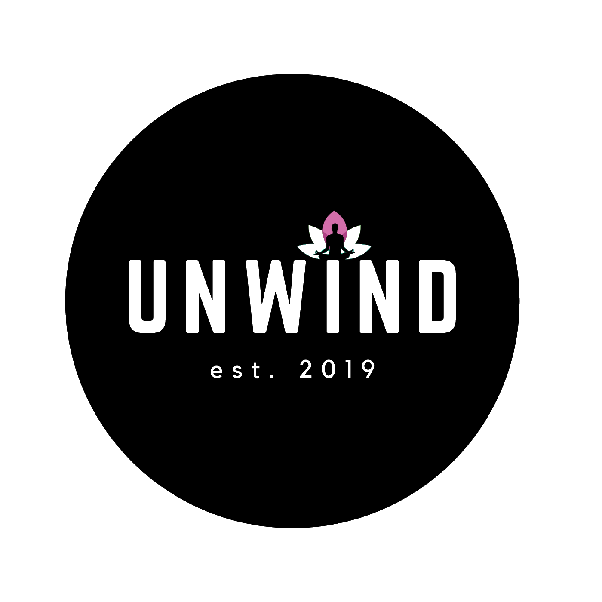
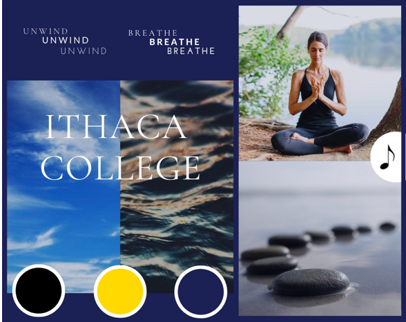
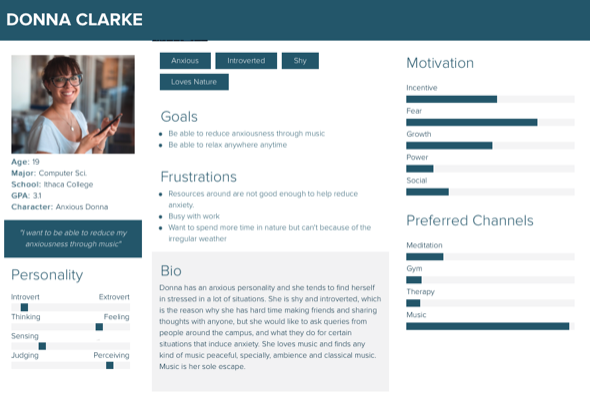
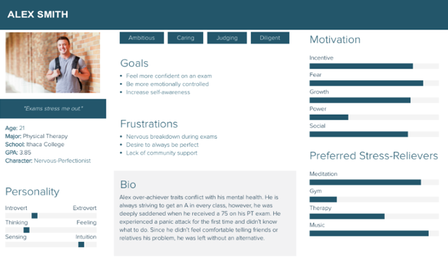
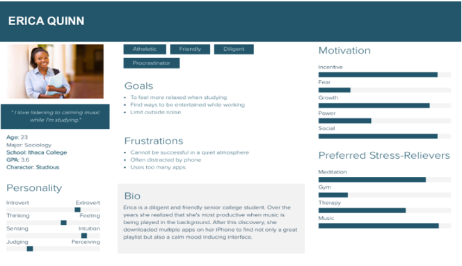
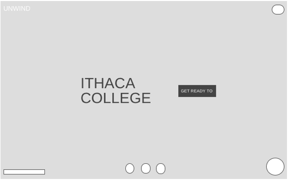
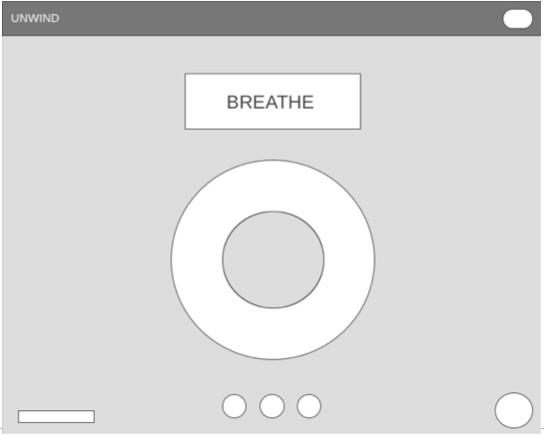
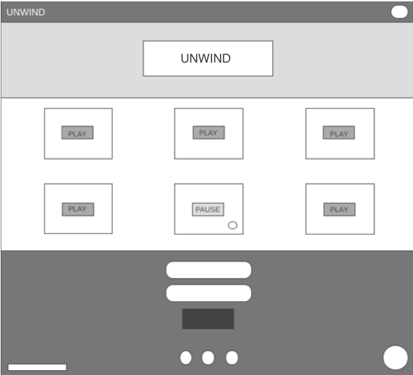
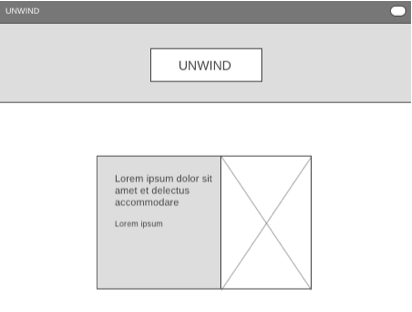
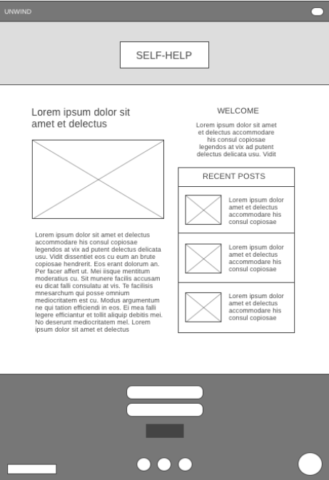

# Unwind

# TABLE OF CONTENTS

### HOME   __________________________________________________________    1
### EXECUTIVE SUMMARY   __________________________________________    3
### MOOD-BOARD   ___________________________________________________  5
### PERSONAS  _______________________________________________________   6
### WIREFRAMES  ____________________________________________________   9
### ARCHITECTURE    ________________________________________________   12
### USER INTERACTION FLOW  ________________________________________ 13
### STYLE-GUIDE    ___________________________________________________ 14
### FUNCTIONALITY   ________________________________________________  26
### EVALUATION  ____________________________________________________  27
### CONTRIBUTIONS  ________________________________________________   28

# EXECUTIVE SUMMARY

Unwind is a mediation plus stress reducing website, which helps college students, particular Ithaca college students to reduce their stress with the help of calm music and guided meditation, as well as breathing circle, which helps you regulate your breathing patterns and help you breathe deeply. Meditation has been shown to help people stress less, focus more and sleep better. Unwind is meditation made simple, it helps you relax within a few minutes a day. With a bit more clarity of mind and stress-free state, what couldn’t you do? 

People also use meditation to develop other beneficial habits and feelings, such as a positive mood and outlook, self-discipline, healthy sleep patterns and even increased pain tolerance. Through meditation and other calming techniques, the user could improve their mental and emotional health. One of the things about the meditation is that if you learn how to do it using our app, you could do it anywhere. I have experienced it myself. When I started doing the meditation as a kid my dad used to guide me, but now as I have inculcated in my life I am able to do anytime anywhere. If the user generates that habit of doing meditation through this app, as it does have guided meditation track, they might able to develop the ability to concentrate and do meditation anywhere and anytime. It becomes a lot easier to focus on things and be able to give those things our hundred percent. Unwind helps provide a number of ways, breathing circle, instrumental meditation, guided meditation, through which you can meditate, and you could choose which one best suits to your goals, as meditation improves your life quality, even if you only have a few minutes to do it each day.

Relaxing music which is one of the features of our website has also proven to make us feel peaceful and helps in the production of serotonin to relieve our stress and relieve physical pain. That's not all, music has a huge impact on our brain, and relaxing music does actually make us feel better. For example, there is a well-known theory, although it’s not yet empirically proven about the good that a frequency of 528 Hz can do to our body. These frequencies are known as the Solfeggio frequencies, originally used in Gregorian chants. Whether it’s healing or not, what we do know is that music is capable of making changes in our mind and body. Solfeggio frequencies can help you balance your energy and keep your body, mind, and spirit in harmony.

We didn't dominantly use the Solfeggio frequencies, but some soothing modern music and traditional instrumental music from around the world for our website. We didn't want our site to be used by only the people who are fond of the Solfeggio frequencies, we wanted to have a mix of styles to suit a plethora of people. We used a lot of nature sounds on our website, particular in our breathe page. The sounds of nature improve our concentration. Whether its the sounds of the birds chirping, water falling, boat sailing through the water, the rustling of leaves, or simply the sound of pouring rain, the nature sounds have a certain cathartic effect in our body. It is like we go back to where we came from. It focuses us and liberates us at the same time. It has that organic feel that makes us satiated about ourselves and our surroundings.

One of the reasons why we have used the breathing circle is because we want people to understand the importance of every single breath and how deep breathing could help us alleviates stress, improve confidence, and help maintain normal blood circulation. Breathing is free and effortless and with the ambient nature sound in the background, we could deceive our brains into thinking about being in a natural place which is quite rare in this advanced and urbanized world where people don't have time to go in nature and embrace it. Through this website, it’s easy to lose yourself in the pseudo-natural environment for some time. We also use very soothing pictures on our website to accompany the feel of our stress-reducing platform. 

On the top of this all, we have also implemented a random positive quote generator, which strives to motivate and inspire the users. According to an article on the Lifehack, “Daily inspirations remind you that you are not alone.”, it will help the users to feel that they are not alone who are struggling with this, but there are many others out with the similar or worse problems. Daily positive quotes also act as a reminder for what we want to chaise in our lives and how to do it; they are a push for something you really strive to achieve in life. We want our users to keep on moving on in life with a positive attitude, even when the times are rough.

We have also implemented the blog style pages which are the friends and self-help pages, they include al the information and the articles and relevant for the IC students. For the self-help page there are different tips and tricks that suggest the users how to be less stressed and help yourself through rough times. Similarly, the friends page is a resource guide through which you can get the hep of your friends and read off the articles from the peel around the campus. The CAPS pages directly links the user to the IC CAPS resources page, which tells the students about the mental health and stress reducing resources around the campus.

One of the reasons why we thought of making something like this is because we both are perfectionists and want everything to be perfect. If by chance something doesn't work out the way we intended we feel very stressed and dysfunctional. Moreover, we stress a lot about menial situations such as coursework in college, future internships, today’s meal, or it could be something really small, but unfortunately, it’s in our nerves to be a little concerned and over-think every situation. Through this website, we were able to reduce stress ourselves as we did find ourselves using this site while doing our homework. For us this has been the most happening and exciting as we created something that could help us and other people around the campus, if they feel the same as us, or for their recreational purposes.

# MOOD-BOARD

Here is a picture of our mood-board, which depicts the vibe of our website. It has calming nature and relaxing pictures which complements our website. It includes the color scheme and the fonts we used. We have a lady doing meditation, which tells the user that our website has to do something with meditation and yoga. We strived to make our site as similar as possible to the mood-board as we really thought this mood-board is very relaxing and energizing. This mood-board has a little sound icon which depicts that our site has to do something with the sounds, which indeed is one of the dominant features of our website. Mostly, we wanted to make our site very soothing and easy on eyes that's the reason why we used cool colors, instead of pop and bold ones. We have a tinge of yellow which complements the IC blue. We also used the logo of the Ithaca college as we intended making it for IC students in particular as for now. We could make it public but we thought of starting it off small and spreading it wide, like any other service out there.

# PERSONAS

## Persona 1

One of our personas is Donna Clarke, who is an introverted Computer science major. She usually finds herself anxious in most of the situations. She is not very boisterous and doesn't really share her thoughts and ideas with anyone. However, she loves music and wants to find a way through which she can listen to music and relax. She is fond of nature also, but can’t be around nature all the time in Ithaca because of the fickle and extreme weather. She would love to have a service that could help her reduce the stress and anxiety, as well as, help her concentrate on her stuff. She believes meditation could be one such way to gain ability to focus more, but she isn't sure what might be a good option for her that could do everything she really wants. She would really like the Unwind app as it would enable her to do everything she desires while being less anxious.

## Persona 2

## Persona 3

# WIREFRAMES

The reason why we have used these wireframes is that they look very professional as well as are not very chaotic. They have that look of a professional as well as relaxing website, which doesn't comprise of irrelevant noisy information that could clutter our users’ visuals. We wanted a sleek and minimal website with relevant information and visuals, as well as with prominent buttons and forms, which could be used by anyone. We tried to make this website as accessible as possible, but if we had more time we could have made it more different user-friendly, special for the people who are visually impaired. 

We kept in mind the mapping in each and every page, as well as, all the other relevant stuff we have learned in the HCI class. We tried our best to avoid implementing any false affordances. All the buttons and forms on our website have intended use. We created our website as any website on the internet, which helps the user to navigate through the website easily, as they are used to the websites. We didn't create something very new, which could confuse our users. We also used a popup, which generates positive and inspiring quotes each time we use the site. For that also we used the simple implementation and minimal text and imagery. 

Initially, before creating the website, We found out the elements we needed for the website from the soundtracks, pictures, blog posts, quotes, and the breathing circle. Using these elements we created our website and strived to make it simple and easy to navigate. We didn't use too many colors or images as they can distract the user from focusing on the layout and navigational elements. We made sure to reduce the use of color, images, graphics, and stylized fonts to achieve your goal of depicting a simple visual representation of the skeleton. We have almost on every page the same layout to keep the consistency throughout our website experience. 

The Self-help and the Friends page are blog style as they need some write up information about the different self-help as well as friends resources. For those pages, we tried not to make them very wordy but pages with relevant and useful information for the IC students, for who this website is constructed. We have pictures accompany the article as it looks very content as well as gives the feel of “a picture tells a thousand words”. According to an article in BMC “Images help us learn, images grab attention, images explain tough concepts, and inspire.” It is intact very true, for our website we used inspiring images that could induce positivity in our users.

Our wireframes are a great way to give the basic layout and idea about our website to our users and to show them our early design process. Also, the wireframes push usability to the forefront and using them is a strong way to illustrate the layout of pages and the functionality of the elements on the page. 

These wireframes force us and our users to view our website objectively, is it easy to use, the conversion paths, element placement, and also help them point out any flaws on the early stage. These are all things that lead to our intuitive and soothing website.

# FUNCTIONALITY

We used basic web development platforms, HTML, CSS, JavaScript, Bootstrap, and jQuery. For making the logos and Mood-board we used Canva app, which is designed to create sleek graphic designs. For the inhale and exhale circle we got the code from the xhalr.com, which allowed us to embed their pre-made breathing circle. For making the personas we used xtensio.com, for the wireframes we used the wireframe.cc. These sites have helped us layout and design the website we intended to make. 

Using the basic web development languages helped us create a user experience that we intend while making our wireframes. One of the biggest helped for creating this layout was Bootstrap. 
Bootstrap helps us implement a very sleek and clearly laid out pages without any messiness. Using the Bootstrap grid system really helped us achieved what we intended for. This also gives the user a wholesome and very polished experience. This makes the navigation in our website really easy, as the things are perfectly aligned at the intentional positions. While the HTML helped in the creation of the basic website, CSS helped us give the style to the HTML page, as well as it gave us some of the animations, which really seems to capture our users. JavaScript and jQuery, on the other hand, help us create interactive pages, which really enhanced the user experience to the whole another level. 

Furthermore, the Bootstrap also provide us consistency throughout our website which gives it a similar look on each page, as it helps the user to feel they are on the same site. It really enhances the user experience on our website as it connects everything to one another, even though the pages might have different content. 

Also for our blog pages the HTML and the CSS play a really significant role as they help align the content in the required position, which looks visually soothing and very navigable. The JavaScript and jQuery, play a very significant role in helping us create a usable site. JavaScript not only supports web pages but also supports external applications like PDF documents, running widgets, supporting for flash applications etc. JavaScript has emerged in web industry like a boom and if you look at the current web scenario there are no web technologies that are not using JavaScript. Also it is extremely easy to implement and make it workable just like we did in the Unwind page. JavaScript stands unique as it brings out all the special functionalities in the client’s browser instead of the site’s server. 

# EVALUATION 

For the evaluation of this website, we did a focus group, which included people from around the Ithaca College campus. We showed them this website and asked them how they felt while using it and is it good enough to reduce their stress and anxiety. Our participants varied in the ways through which they relax and their sources for stress reduction. We clearly told them what our website intends to do and what our goals were while creating this website. 

Most of our participants liked the idea of what we have created and would love to use it regularly. As we were showing them the website they kept of saying how relaxing and claiming this whole experience is. Our participants found our website visually pleasing, which is one of the things we intended and we are successful with that. Because of the soothing visuals, we are able to at least set the calm and serene mood through for our users, which induces the positivity and tranquillity within them. This is a thing one of our participants pointed out while interacting with our website, and this made us as developers feel extremely good about our website. 

One of the participants pointed out about the water video on the Home page gave her the feeling of calmness, which is positive feedback for our website as we tried our best to include most of the pleasing and positivity inducing things around the internet. Through our users' expressions, we were able to deduce how they were feeling while using our site, particularly the user who pointed out the video looked really relaxed all of a sudden. It was Interesting to notice users' reactions while they used the site as it really helped us understand users' frustrations and satisfaction. 

Our participants liked the Unwind page as they went through the different music tracks, three of them pointed out the music suited whatever the image was used for that and the different tracks gave them a different vibe. Their reactions with each soundtrack and guided meditation changed accordingly, which was interesting to notice. We were pleased by the fact that they pointed out the imagery and the music relatedness, which we really strived to achieve with our own experience, and we can see that it gives the same feel to our intended users. Many of our users like the sound used for the breath page as it is subtle and complements the breathing activity. Five of our participants really like the idea of the positive pop-up, as quotes help us stay motivated and inspire us at the same time. They are a great way to activate an emotional pulse in our hearts and minds when we are in a distressing situation. The right quote can help us to see light at the end of the tunnel, and give us that extra burst of hope and courage to persevere, one of our participants said this.

Indeed, our website was able to get a lot of positive feedback from our participants but there are still some of the participants who gave negative and constructive feedback, which would really help us iterate this website in the future and make it usable for most of the potential users out there. One of the things that the fact that the colors of the content in the toggle menu remains the same when scrolled down, which makes our participates view the content of the menu hard to read on the Unwind page, as they are white in color just like the background, it would be better to change the color of the menu background, but I don't really know how to change it at this point. Four of our participants pointed out the yellow color on the menu links when hovered over should be altered as it blends in with the white overlay in the background, it is something even we think is a major problem for the people who are visually impaired. A lot of work could be done to improve our menu to be honest, as we ourselves are not very satisfied with it, but for the sake of less noisy layout, we thought of implementing it. 

Many of our participants don't really know how to use there netID to log into the site, as our log-in form is not working at this moment and we would love to make it work in the future when we gain some knowledge of database systems. Our website would become a lot more usable. This is major thing missing from our website as we need the netId to be able to use the mood tracker. We were able to see the frustrations on people’s faces as they tried to use the log-in form, which is in non-workable condition right now.

# BUILT WITH 
* [HTML](https://en.wikipedia.org/wiki/HTML) 
* [Javascript](https://www.javascript.com/) 
* [jQuery](https://jquery.com/)
* [CSS](https://www.w3schools.com/css/)

# CONTRIBUTIONS

* **Isha Sharma**
* **Mariama Diallo**

### "Want To Be More Productive? Listen To The Sounds Of Nature”. Fast Company, July, 2015. [Sneed, Annie.](https://www.fastcompany.com/3047398/want-to-be-more-productive-listen-to-the-sounds-of-nature) 

### “5 Reasons Why We Should Practice Deep Breathing”, Mind Body Green, [Scarbro, Denise](https://www.mindbodygreen.com/0-5018/5-Reasons-Why-We-Should-Practice-Deep-Breathing.html )	

### “Why Nature Sounds Help You Relax, According to Science”, health.com, April 05, 2017, [MacMillan, Amanda](https://www.health.com/stress/why-nature-sounds-are-relaxing)

### 11 Aug 2014, “The power of pictures. How we can use images to promote and communicate science”, BMC, [Balm, James.](http://blogs.biomedcentral.com/bmcblog/2014/08/11/the-power-of-pictures-how-we-can-use-images-to-promote-and-communicate-science/)

### “7 Essential Ways That Inspirational Quotes Can Literally Change Your Day …and Your Life!”, Lifehack, [Belmont, Judy.](https://www.lifehack.org/articles/communication/7-essential-ways-that-inspirational-quotes-can-literally-change-your-day-and-your-life.html)

### “What are the Solfeggio frequencies?”, [Attuned Vibrations](https://attunedvibrations.com/solfeggio/)	

# Authors

* **Isha Sharma** - [Ishasharmax](https://github.com/ishasharmax)
